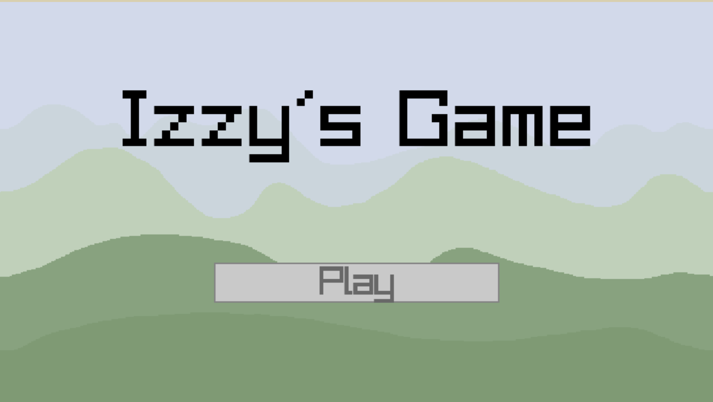
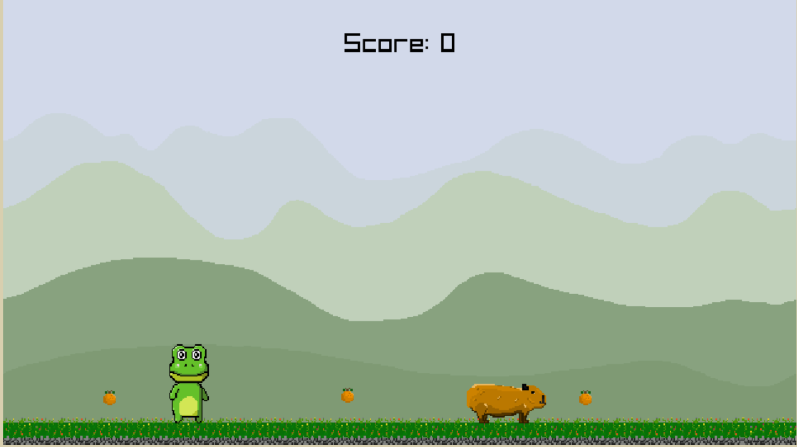

# Izzys Game

Welcome to a game I have created using the game library Raylib as well as box2D for 2D physics.

This game was created with inspiration from Jetpack Joy Ride for its side scrolling nature as well as Fireboy and Watergirl for its cooperative game play.

The idea of the game is that you play as a capybara and a frog searching to collect oranges that were stolen by the stimky pelicans (references for all capybara lovers). The game itself is a side scrolling platformer requiring the capybara and frog to work together in two player co-op style (classic co-op using wasd and arrows) to collect as many oranges as possible and not fall off any platforms.

All game art was drawn by me in a pixel art style. The art resources can be found in the assets folder.

This is my first step out into sharing my code with people so I hope you all enjoy. I have written this game implementing my own (admittedly basic) entity component system as well as various utility classes that can be used for things such as tiling and animation within Raylib.

I am also hosting this game on heroku at:

https://izzys-game.herokuapp.com/

Thank you all and I hope you enjoy!

